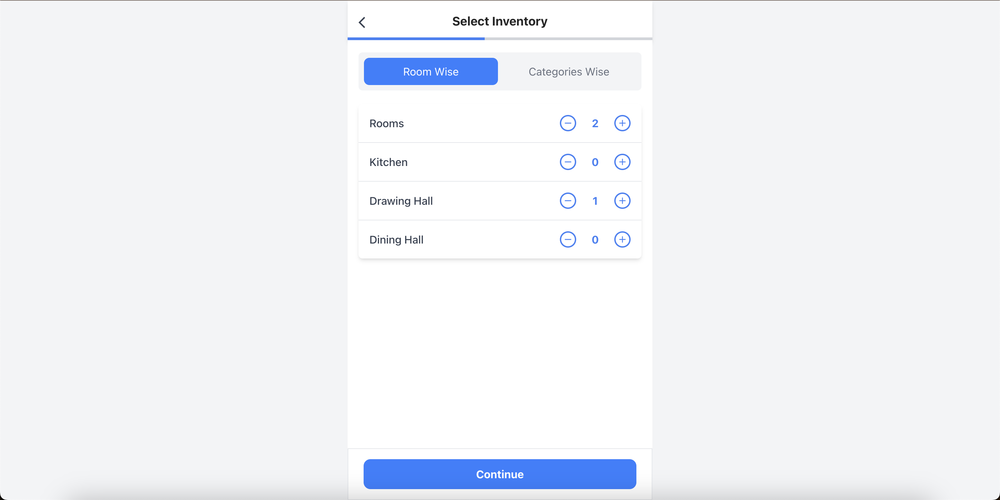
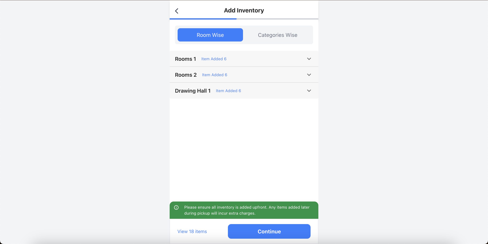
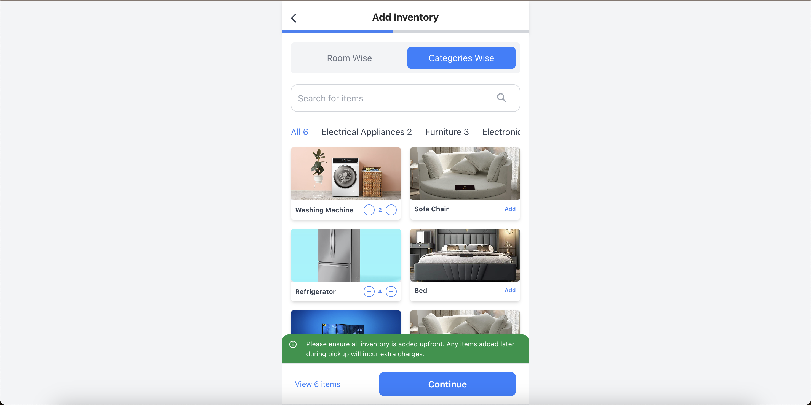
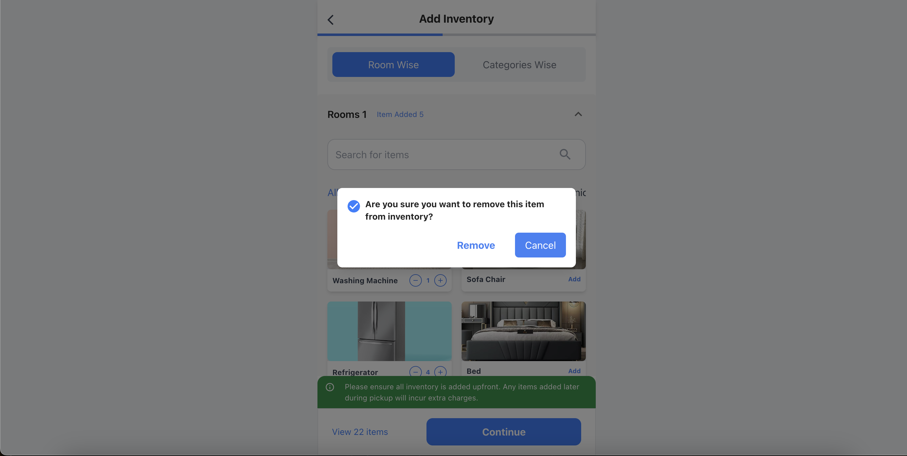

# Happy Locate Assignment

## Live Demo

Access the live view of the project [here](https://happy-locate-five.vercel.app/).

## Project Screenshots

<table>
  <tr>
    <td>
      
    </td>
    <td>
      
    </td>
  </tr>
  <tr>
    <td>
      
    </td>
    <td>
      
    </td>
  </tr>
</table>

## Setup Instructions

### 1. **Extract the Project**

- Extract the provided zip file into your desired directory or you can clone the repository using the following command:

```bash
git clone https://github.com/ranajitdasgithub/Happy-locate-assignment.git
```

### 2. **Navigate to the Project Directory**

```bash
cd happy-locate-assignment
```

### 3. **Install Dependencies**

Run the following command to install all required dependencies:

```bash
npm install
```

### 4. **Run the Application**

Start the development server using:

```bash
npm start
```

The app will be accessible at `http://localhost:3000` in your browser.

### 5. **Build the Application (Optional)**

To create a production build, use:

```bash
npm run build
```

## Project Structure

```plaintext
project-root/
│
├── public/
│ ├── index.html
│ ├── favicon.ico
│ └── manifest.json
│
├── src/
│ │
│ ├── components/
│ │ ├── Layout/
│ │ │ ├── Header.jsx
│ │ │ ├── Footer.jsx
│ │ │ └── TabsNavigation.jsx
│ │ ├── Inventory/
│ │ │ └── SelectInventory.jsx
│ │ ├── Shared/
│ │ │ ├── CounterButton.jsx
│ │ │ ├── CustomButton.jsx
│ │ │ ├── LazyImage.jsx
│ │ │ ├── SearchBar.jsx
│ │ ├── RoomDetails/
│ │ │ ├── RoomDetailsForm.jsx
│ │ │ └── RoomList.jsx
│ ├── hooks/
│ │ ├── useInventoryManagement.js
│ │ └── useInventorySelection.js
│ ├── pages/
│ │ ├── AddInventoryPage.jsx
│ │ └── SelectInventoryPage.jsx
│ ├── Modals/
│ │ ├── AddedItemsModal/
│ │ │ └── AddedModal.jsx
│ │ ├── RemoveModal/
│ │ └── RemoveModal.jsx
│ ├── redux/
│ │ ├── store.js
│ │ └── appSlice.js
│ ├── services/
│ │ └── api.js
│ ├── styles/
│ │ └── index.css
│ ├── App.jsx
│ └── index.js
├── package.json
├── tailwind.config.js
└── README.md
```

## Tech Stack

### Frontend

- **React**: Core library for building the user interface.
- **Redux**: State management.
- **Material UI**: UI components.
- **Tailwind CSS**: Utility-first CSS framework.

### Performance Optimizations

- **React Lazy Loading**: Dynamically load components to reduce initial load time.
- **Redux-Persist**: Persist state across sessions.
- **useMemo & useCallback**: Optimize rendering and avoid unnecessary function re-creations.

## Features

- Add inventory items with real-time updates.
- Responsive design with Material UI and Tailwind CSS.
- Lightweight and optimized for performance.
- Modal feedback for user actions (e.g., successful inventory addition).
